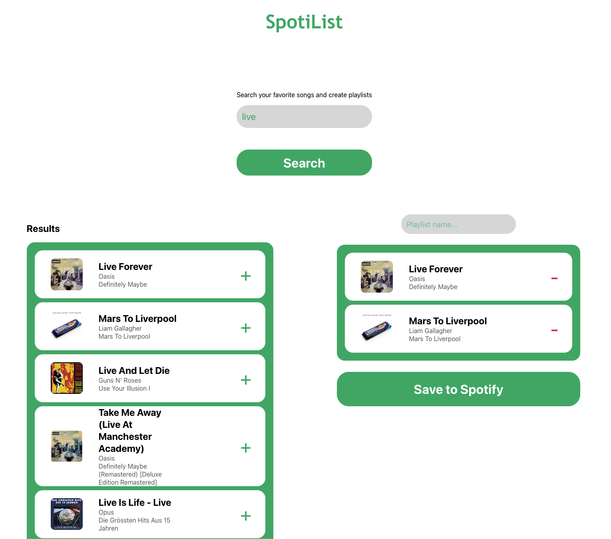
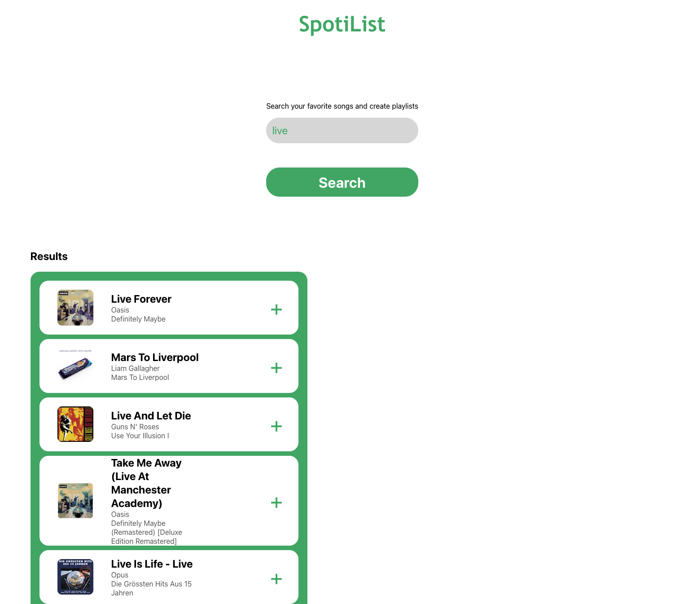
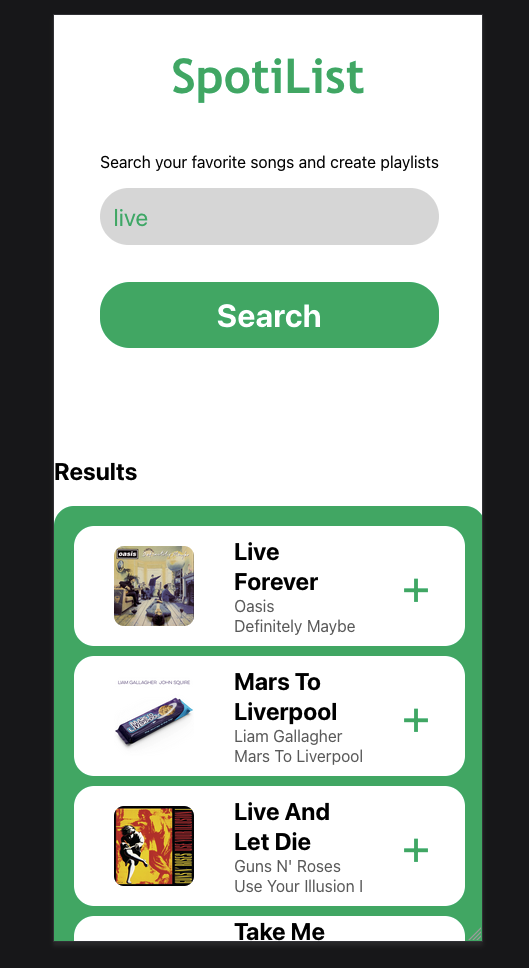
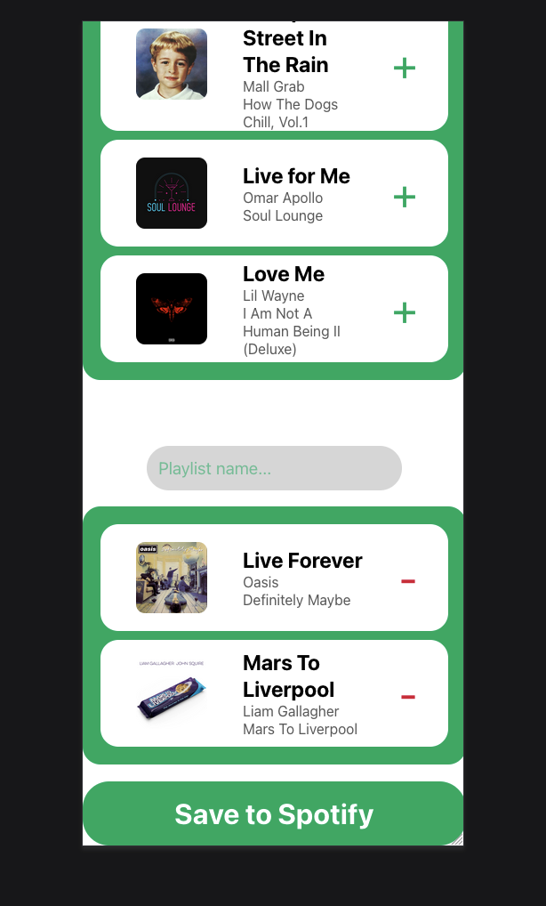

# SpotiList. A simple Spotify playlist creator

This project was bootstrapped with [Create React App](https://github.com/facebook/create-react-app).

## Go to [spotiplaylist.app](https://spotiplaylist.netlify.app)

## About

Spotilist is a simple React app that searches the Spotify library for song and creates playlists. It's part of the Full Stack Engineer 
path's curriculum of Codecademy. Althouth it's a very simple project, it could clearly encapsulate a lot of technologies and be a worthy
portfolio project. 

## Technologies used

+ React
+ Javascript
+ SCSS(Sass)
+ HTML5

## Features

Spotilist has the following features:

+ It can search the Spotify Library for tracks. These will be listed with a limit of 20 tracks.
+ It can create playlists with the tracks you add to the playlist. You give a name, press the Save To Playlist and done!

## Future Enhancements

I wanted to create this project with Typescript because it's more versatile and safe, but as it was my first real React project,
I wanted to make sure that it will work with plain Javascript. I'm going to replace the Javascript with Typescript in the future.

Some changes would be beneficial with respect to React. There's space for improvement in the React code, for example I could use Reducers in
some cases to make the code more readable and keep it DRY. 
Also, the error validation is pretty simple. I could improve it by creating components that will render the necessary html when something's 
wrong to inform the user.

Another thing that must be done is some minor affordances with respect to user interaction. At the time being, when the user hovers over the 
search results(a song), it won't give any feedback whether it's possible to press. Although I have clearly created a + (plus) button to indicate
the add action to the playlist, it would be far more useful to give some visual feedback(other than the obvious button) to the user that they
can press the song to add it in the playlist. The same goes for the - (minus/remove) button. 
Furthermore, when we create a playlist, there isn't any feedback that the playlist has been created successfully 

All these enhancements above would contribute to create a complete project that demostrates my proficiency as a programmer. 

## Screenshots

